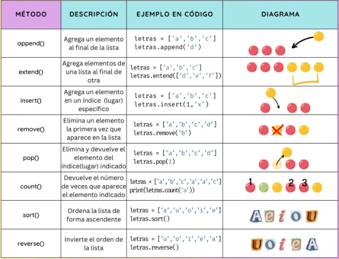
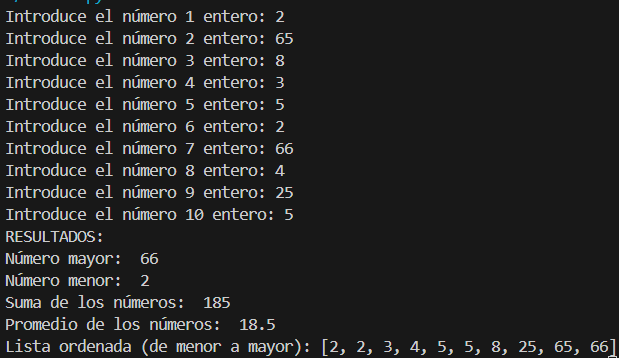

# LISTAS

## 1.-QUE SON LAS LISTAS EN PROGRAMACIÓN
### En programación, una lista es una estructura de datos que organiza y almacena elementos de manera secuencial y ordenada. Las listas permiten almacenar múltiples valores bajo un solo nombre y acceder a ellos mediante índices.

[link de referencia](https://www.apinem.com/listas-programacion-que-son-y-para-que-sirven/)
### Una lista se crea con [] separando sus elementos con comas (,). También se puede crear usando list y pasando un objeto iterable. 
   ```bash
   lista = [1,2,3,4]
   lista = list("1234") 
   ```
### Una lista puede contener distintos tipos de datos (int,string,bool,float), lo que lo hace muy flexible.
   ```bash
   lista = [1,"Hola",true,3.67]
   ```
## 2.-PROPIEDADES DE LISTAS
### Algunas propiedades de las listas:
### -Son ordenadas, mantienen el orden en el que han sido definidas
### -Pueden ser formadas por tipos arbitrarios
### -Pueden ser indexadas con [i].
### -Se pueden anidar, es decir, meter una dentro de la otra.
### -Son mutables, ya que sus elementos pueden ser modificados.
### -Son dinámicas, ya que se pueden añadir o eliminar elementos.

[link de referencia](https://ellibrodepython.com/listas-en-python)

## 3.-MÉTODOS DE LISTAS
### Los métodos de listas en Python son funciones integradas que puedes aplicar a listas para realizar diversas operaciones


[link de referencia](https://www.linkedin.com/posts/sergiecode_python-cheatsheet-programador-activity-7122903417215172612-Ci6B?utm_source=share&utm_medium=member_desktop&rcm=ACoAADdDnmgBeK9rANzecnAfN45lyxPGpu06ayY)

## 4.-EJEMPLO
### Crear una lista que almacene 10 números enteros introducidos por el usuario, Mostrar el máximo valor, mínimo, la suma y el promedio de los valores de la lista, ordenar la lista de menor a mayor (Código en Listas.py).

Resultados esperados
